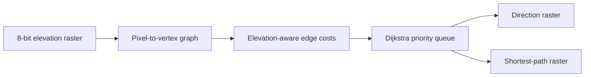

# Shortest Path on an Elevation Map

[](https://isocpp.org/)
[](https://en.wikipedia.org/wiki/Dijkstra%27s_algorithm)
[](#build)

A C++ implementation of Dijkstra's algorithm for finding least-cost routes across a grayscale elevation map.

## Problem model



Unlike a simple shortest-step calculation, each move is weighted by elevation change, so flatter routes can be preferred over geometrically direct but steeper routes.

## Approach

- Models each pixel as a graph vertex.
- Connects each location to its north, east, south, and west neighbors.
- Calculates edge cost from horizontal movement and elevation change.
- Uses a min-priority queue to compute shortest distances efficiently.
- Produces raw direction and path-visualization outputs.

## Complexity

For `V` pixels and at most four edges per pixel, the priority-queue implementation runs in approximately `O((V + E) log V)`, which simplifies to `O(V log V)` for this grid.

## Build

Open `ShortestPathElevationMap.vcxproj` in Visual Studio 2022, or compile directly:

```console
g++ -std=c++17 -O2 main.cpp -o elevation-path
```

Place a 250×200, 8-bit grayscale elevation file named `map1.raw` in the working directory, then run the executable. It writes `direction.raw` and `path.raw`.

The original course input dataset is not redistributed.

## Skills demonstrated

C++, graph modeling, Dijkstra's algorithm, priority queues, binary file I/O, and algorithmic complexity analysis.

## Verification status

The source and Visual Studio project are included, but a local C++ toolchain was unavailable during the latest portfolio packaging pass. Build instructions are provided so the implementation can be verified with Visual Studio 2022 or a C++17 compiler.

## About the author

Built by **Ahmed Balde** as a graph-algorithm and binary-raster processing project. See more C++, Python, data, and software-engineering work on [GitHub](https://github.com/fetachino).
